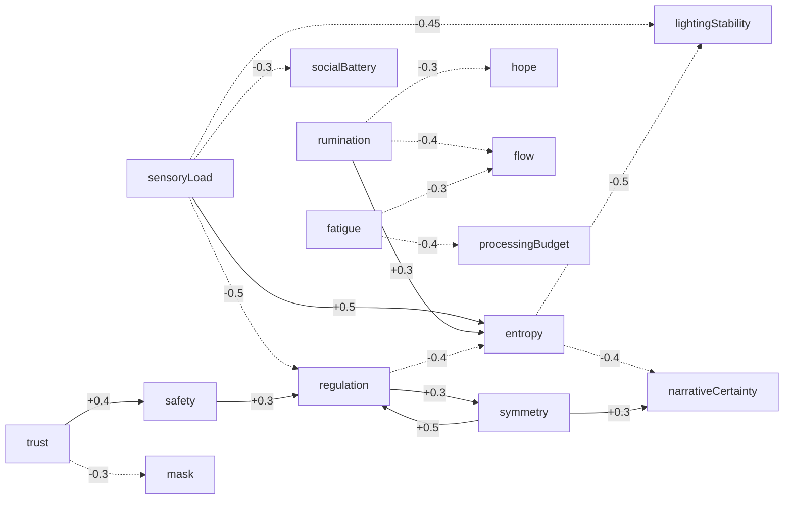

# HOUSE REFERENCE — generated

> **GENERATED FILE — do not hand-edit.**
> `node tools/gen_house_reference.js`

Facts only, read straight out of `web/house.js`, `web/field/config.js` and
`web/field/moments.js`. The *meaning* lives in `DESIGN.md`; this is the
numbers, so they cannot drift out of agreement with the code.

Regenerate after touching any of those three files. `tools/check_docs.py`
verifies this file is current.

## The State Bible — 26 variables

`up`/`down` are gains applied to positive/negative pushes — asymmetry is the
point (stress rises fast and falls slow; trust rises slow and collapses
fast). `decay` is the pull per second back toward `rest`. Crossing
`threshold` leaks into the neighbours listed in the feedback column.

| variable | rest | up | down | decay | threshold | leaks into |
|---|---|---|---|---|---|---|
| `sensoryLoad` | 0.18 | 1.5 | 0.9 | 0.06 | 0.6 | regulation -0.5, lightingStability -0.45, entropy +0.5, socialBattery -0.3 |
| `rumination` | 0.15 | 1.3 | 0.7 | 0.05 | 0.55 | hope -0.3, flow -0.4, entropy +0.3 |
| `fatigue` | 0.2 | 1 | 0.4 | 0.03 | 0.7 | processingBudget -0.4, flow -0.3 |
| `entropy` | 0.35 | 1.2 | 0.8 | 0.12 | 0.65 | lightingStability -0.5, narrativeCertainty -0.4 |
| `trust` | 0.35 | 0.5 | 1.6 | 0.02 | 0.6 | safety +0.4, mask -0.3 |
| `safety` | 0.4 | 0.5 | 1.5 | 0.03 | 0.6 | regulation +0.3 |
| `hope` | 0.4 | 0.6 | 1.2 | 0.03 | – | – |
| `regulation` | 0.45 | 0.7 | 1.1 | 0.04 | 0.8 | entropy -0.4, symmetry +0.3 |
| `flow` | 0.3 | 0.8 | 1 | 0.06 | – | – |
| `curiosity` | 0.4 | 1 | 0.9 | 0.05 | – | – |
| `novelty` | 0.5 | 1.1 | 1 | 0.09 | – | – |
| `mask` | 0.5 | 1 | 0.8 | 0.02 | – | – |
| `socialBattery` | 0.6 | 0.7 | 1 | 0.02 | – | – |
| `symmetry` | 0.1 | 1.2 | 1.2 | 0.15 | 0.85 | regulation +0.5, narrativeCertainty +0.3 |
| `lightingStability` | 0.7 | 0.8 | 1 | 0.05 | – | – |
| `narrativeCertainty` | 0.4 | 0.7 | 1 | 0.04 | – | – |
| `musicIntensity` | 0.3 | 1 | 0.9 | 0.07 | – | – |
| `heartbeat` | 0.35 | 1.1 | 0.7 | 0.06 | – | – |
| `breathing` | 0.5 | 0.8 | 0.8 | 0.05 | – | – |
| `processingBudget` | 0.7 | 0.8 | 0.8 | 0.04 | – | – |
| `workingMemory` | 0.6 | 0.8 | 0.8 | 0.04 | – | – |
| `alexithymia` | 0.6 | 0.6 | 0.6 | 0.02 | – | – |
| `justiceSensitivity` | 0.6 | 0.9 | 0.7 | 0.02 | – | – |
| `playerConfidence` | 0.4 | 0.8 | 0.9 | 0.03 | – | – |
| `operatorIntent` | 0 | 1 | 1 | 0.08 | – | – |
| `houseMemory` | 0 | 1 | 1 | 0 | – | – |

### The leak graph

This is DESIGN.md invariant 1 ("every room affects the whole house") as
actual wiring: 18 couplings across 15 variables. Solid = the
source variable raises its target, dashed = it suppresses it.

**Uncoupled (11):** `curiosity`, `novelty`, `musicIntensity`, `heartbeat`, `breathing`, `workingMemory`, `alexithymia`, `justiceSensitivity`, `playerConfidence`, `operatorIntent`, `houseMemory`.

These have physics but no threshold feedback — they are read by organs
rather than leaking on their own. Present for State-Bible completeness.

## The arc

| phase | gate | horizon (hops) |
|---|---|---|
| 1 Curiosity | — | 1 |
| 2 Investigation | {"developed":3} | 2 |
| 3 Empathy | {"casesWalked":2,"developed":8} | 99 |
| 4 Integration | {"developed":18,"casesWalked":4} | 99 |

Hysteresis 1. Phase 3 sets `layout.hyperPull` to 1 and eases over `layout.relayoutTime` = 14s — the piece's central moment.

Develop lock: σ ≥ **0.9**, permanent (`relockable: false`).

## Agency — the seven

| variable | rest | rate (/s) |
|---|---|---|
| `curiosity` | 0.45 | 0.02 |
| `trust` | 0.3 | 0.008 |
| `defensiveness` | 0.25 | 0.03 |
| `attention` | 0.4 | 0.045 |
| `coincidence` | 0.2 | 0.015 |
| `nostalgia` | 0.15 | 0.006 |
| `initiative` | 0.35 | 0.012 |

Urge accumulates at `0.035`/s and fires at `1`. After acting: `22`s of enforced silence. The house may not act at all for the first `45`s, and never more than `3`×/minute. Intents below strength `0.25` are dropped rather than muttered.

Intent weights: `light` 1 · `field` 0.8 · `clue` 0.5 · `memory` 0.4 · `music` 0.6 · `interrupt` 0.2.

## Beds — the middle tier

Priority 2–3, between ambient (0) and events (5). Alpha is a continuous
function of house state, never switched. **Keep ceilings low** — if you can
point at a bed and name it, it is too loud.

| id | layer | pri | driver | floor | ceil | enabled |
|---|---|---|---|---|---|---|
| `shimmer` | Sparkle | 2 | dopamine | 0.06 | 0.34 | yes |
| `swell` | Pulse | 3 | arousal | 0.04 | 0.26 | yes |
| `unease` | Ripple | 3 | entropy | 0 | 0.22 | **no** |

Bed light params (C# declared units — **not clamped server-side**):

- `shimmer` → color=FFE4B0, brightness=55, flashDuration=2.4, spawnRate=0.8
- `swell` → color=6E7BD0, frequency=0.35, waveNumber=2.0, minBri=20, maxBri=70
- `unease` → color=4A8B8C, rippleRate=0.25, speed=0.6, ringWidth=0.6, brightness=45

## Moments — the reward channel (9)

Each moment pushes the organism; the ambient model renders the flare
itself ("ride on top", no lamp lock). A stressed house therefore mutes
your reward — that is deliberate.

| moment | effect | secs | dopamine | bloom | shock (str/hops/spd) |
|---|---|---|---|---|---|
| `resolve` | Ripple | 3.8 | 1 | 1 | 1/3/2.6 |
| `readMatch` | Sparkle | 2.2 | 0.35 | 0.4 | 0.4/1/2.2 |
| `readMiss` | ColorSwap | 3.6 | 0.1 | 0.2 | 0.3/1/1.4 |
| `caseOpen` | Scanner | 3.6 | 0.25 | 0.5 | 0.5/2/2 |
| `caseWalked` | Comet | 3.8 | 0.7 | 0.8 | 0.8/4/2.2 |
| `phase2` | Wave | 4.2 | 0.6 | 0.7 | 0.7/4/2 |
| `phase3` | Fireworks | 6 | 1 | 1 | 1/99/1.1 |
| `phase4` | Heartbeat | 8 | 0.8 | 0.9 | 0.9/99/0.8 |
| `agency` | Meteor | 2.2 | 0.2 | 0.3 | 0.35/2/1.6 |

### What each moment does to the organism

- **`resolve`** — regulation +0.3, narrativeCertainty +0.24, flow +0.22, symmetry +0.15, sensoryLoad -0.1, playerConfidence +0.15
- **`readMatch`** — narrativeCertainty +0.18, trust +0.1, regulation +0.08
- **`readMiss`** — mask +0.14, entropy +0.1, narrativeCertainty -0.06
- **`caseOpen`** — curiosity +0.2, narrativeCertainty +0.1, sensoryLoad +0.05
- **`caseWalked`** — narrativeCertainty +0.35, regulation +0.22, hope +0.15, rumination -0.12
- **`phase2`** — curiosity +0.25, narrativeCertainty +0.18, novelty +0.3
- **`phase3`** — regulation +0.45, narrativeCertainty +0.45, symmetry +0.3, entropy -0.3, rumination -0.2, hope +0.25
- **`phase4`** — regulation +0.5, symmetry +0.4, entropy -0.35, safety +0.3, hope +0.3, sensoryLoad -0.2
- **`agency`** — novelty +0.15

### Moment light params

**These are in each C# layer's own declared units and are NOT clamped by
the server.** Brightness params are on a 10–100 *percent* scale; sending
`1.0` means 1%, not full. Validate with `node tools/check_light_params.js`.

- `resolve` → **Ripple** 3.8s · color=F2C978, rippleRate=0.9, speed=1.5, ringWidth=0.35, brightness=100
- `readMatch` → **Sparkle** 2.2s · color=FFE9C0, brightness=70, flashDuration=0.6, spawnRate=3.5
- `readMiss` → **ColorSwap** 3.6s · colorA=8E7CC3, colorB=4A8B8C, swapInterval=0.4, brightness=65
- `caseOpen` → **Scanner** 3.6s · headColor=F2C94C, glowColor=3A3358, speed=2.5, glowWidth=2, brightness=80
- `caseWalked` → **Comet** 3.8s · headColor=FFF0D0, tailColor=6E63A8, speed=0.7, tailLength=5, headBrightness=100
- `phase2` → **Wave** 4.2s · color=D4A055, speed=0.5, waveWidth=0.5, peakBrightness=90
- `phase3` → **Fireworks** 6s · palette=F2C94C,8E7CC3,F5E6D0,4A8B8C, burstRate=1.4, radius=2.0, brightness=100
- `phase4` → **Heartbeat** 8s · color=F5E6D0, syncBpm=true, brightness=85
- `agency` → **Meteor** 2.2s · headColor=BEB4E0, tailColor=241F38, count=2, speed=1.5, tailLength=4

