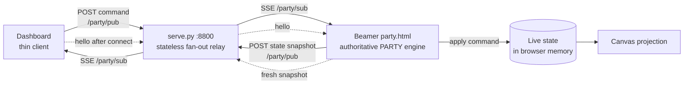
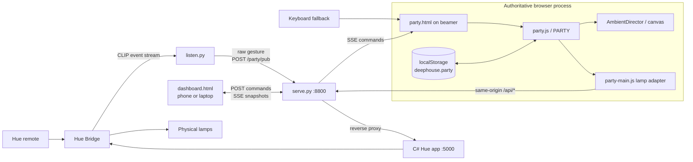
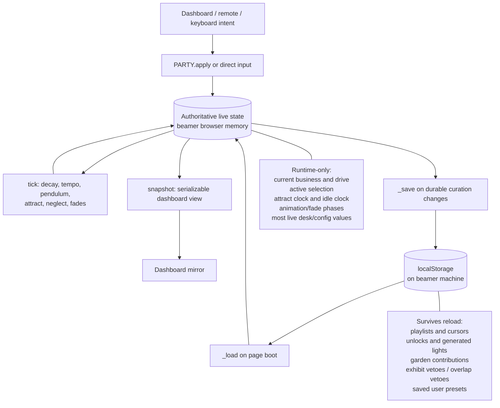
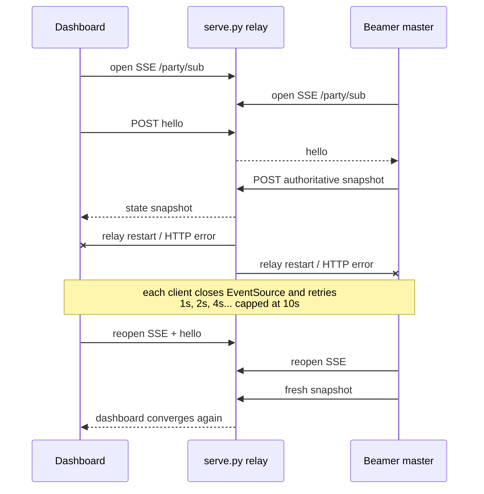

# Party installation: operational architecture

> A reusable Reader's Digest of the dashboard-to-beamer control path, relay and
> rendering topology, runtime authority, persistence, reconnects, show operation,
> and failures found in live use. It intentionally excludes private source material,
> narrative content, and credentials.

## The 30-second model

The **beamer browser is the application server**. `party.html` loads the pure
`PARTY` engine, owns the only mutable live state, renders the projection, and sends
derived parameters to the lamps. The dashboard is a thin remote view. `serve.py` is
only the web origin, Hue reverse proxy, and an in-memory message fan-out; it neither
owns nor stores show state.

Dashboard commands travel by HTTP `POST /party/pub`. The relay copies each JSON
message into every current subscriber's queue. The beamer receives it over
`EventSource /party/sub`, applies it to `PARTY`, and republishes an authoritative
snapshot. The dashboard receives that snapshot on its own SSE subscription and
updates its controls. A `hello` after connecting asks the beamer for a fresh snapshot.

This is command/snapshot replication, not peer-to-peer synchronization. There is one
writer of truth and any number of disposable views.

## Runtime topology

Important boundaries:

- `party.js` owns behavior and state transitions. It is pure enough to run in Node tests.
- `party-main.js` is the browser host: animation loop, rendering, relay subscription,
  snapshot publication, and lamp pushes.
- `dashboard.js` never runs the engine and never declares a state update successful
  until it sees the beamer's next snapshot.
- `serve.py` keeps subscriber queues only. Restarting it loses no authoritative state,
  but messages sent while no subscriber is present are lost.
- The C# Hue process is a renderer/actuator. It does not decide show behavior.

## Authority, snapshots, and persistence

The browser's `localStorage` is selective curation persistence, not a checkpoint of
the running show. A reload reconstructs a valid show from defaults plus saved catalog
choices; it does not resume the exact frame, energy, active scene, or dashboard tuning.
Stored playlist IDs are validated against the current catalog. Unknown historical IDs
are dropped so stale storage degrades to an empty, runnable playlist rather than a
black projection.

The Python relay has no replay buffer. The recovery contract is instead:

1. a dashboard opens an SSE connection;
2. it publishes `hello`;
3. the beamer answers with `PARTY.snapshot()`;
4. the dashboard renders that authoritative snapshot.

## Reconnect behavior

Both browser sides implement explicit exponential reconnect because an `EventSource`
that encounters an HTTP error (notably a 404 from an old server) may stop retrying.
The delay resets to one second on a successful open and caps at ten seconds. SSE also
gets a comment keepalive every 15 seconds from the server.

Snapshot publication is change-aware: at most about 4 Hz while state changes, and a
1 Hz heartbeat when idle. Dashboard DOM structure is rebuilt only when its structural
key changes; live numeric values update in place. This avoids deleting a button between
`mousedown` and `mouseup`, which previously swallowed operator clicks.

## Boot and show workflow

Start in dependency order:

1. Start the C# Hue app on `:5000` and confirm the required branch/build is current.
2. Start `python controller/serve.py` on `:8800`.
3. Open `http://127.0.0.1:8800/party.html` on the beamer machine. Use
   `127.0.0.1`, not `localhost`, on this Windows host.
4. Open `http://<LAN-IP>:8800/dashboard.html` on the curator device.
5. If using the physical remote, start `python -u controller/listen.py --party` and
   confirm presses arrive. Keyboard control remains the fallback.
6. Before running automation such as a showreel, check `GET /party/stat`; zero
   subscribers means there is no beamer host to consume commands.

Normal `party.html` boot enables attract mode. `?manual` disables it; `?debug` adds the
HUD; `?fast` shortens decay for testing; `?nolamps=1` makes the projection read-only
with respect to Hue so a light technician can own the lamps. Treat these as operating
modes, not decorative flags.

Pre-show checks:

- dashboard says **live** and reflects the beamer's current scene;
- one dashboard change appears on the projection and then echoes back in the snapshot;
- lamp HUD/status is online and a scene/palette change is visible on real lamps;
- remote `initial_press` and release events appear, with holds returning drive to zero;
- keyboard navigation works even if the remote or network fails;
- `/party/stat` reports at least the expected beamer/dashboard subscribers.

## Recovery and fallbacks

| Failure | Expected behavior | Operator action |
|---|---|---|
| Dashboard disconnects | Beamer and lamps continue; dashboard reconnects and asks for a snapshot | Wait for **live**; reload dashboard if necessary |
| `serve.py` restarts | Beamer keeps rendering from browser memory; relay traffic pauses | Restart relay; both pages reconnect; verify one command round-trip |
| Hue app is down | Projection continues; lamp calls back off instead of occupying every browser connection | Restart/rebuild Hue app; confirm the effect is recreated |
| Hue app restarts while page stays open | Parameter patch can report that no layer exists; host drops its `started` latch and recreates Superfluid | If lamps remain dark, reload `party.html` after confirming Hue is healthy |
| Remote path fails | Keyboard remains additive and local to the beamer | Use keyboard; inspect `listen.py -u --party` output later |
| Dashboard command is posted with no beamer | Relay returns 204 but nobody applies it | Check `/party/stat`; open `party.html`; resend |
| Persisted IDs are stale | Loader filters missing catalog entries | Continue; clear `deephouse.party` only when a deliberately clean start is wanted |
| Phone/remote focus owner crashes | Server-side focus claim expires back to party | Wait for TTL or reclaim/release focus from the active surface |

## Known live-use failures and the reusable lessons

1. **A healthy transport is not proof of an active consumer.** `/party/pub` returns
   204 even with zero subscribers. Add a preflight that checks presence before a timed
   or destructive automation run.
2. **`localhost` can be a UX bug.** On this Windows/IPv4-only binding it first tried
   IPv6 and added roughly two seconds per connection. Delayed button edges felt like
   autonomous behavior. Pin loopback traffic to `127.0.0.1` when the bind is IPv4.
3. **Slow actuator requests can starve control.** Browsers have a small per-origin
   connection pool. Repeated requests through a dead Hue proxy starved the SSE channel.
   Change-gate writes, time them out, and back off aggressively while offline.
4. **Reconnect must include resynchronization.** Reopening a socket is insufficient
   because the relay has no history. The `hello` → authoritative snapshot handshake is
   what makes the dashboard correct again.
5. **A successful patch may patch nothing.** After the C# process restarts, its active
   layer is gone although the browser's `started` latch remains true. The API must report
   whether a target actually existed; on `softUpdate:false`, rebuild the effect.
6. **Remote arrival time is not gesture time.** The bridge event stream was measured in
   roughly one-second buckets. Chords and press duration cannot be inferred reliably.
   Integrate holds locally, use repeat events as a lease, and auto-release after silence.
7. **Never bind live animation phase to `elapsed × tunableRate`.** Changing rate then
   teleports the phase and looks like a flash. Integrate `phase += rate × dt`.
8. **Brightness motion reads as flashing.** Put ambient motion into spatial color and
   keep per-lamp brightness in a narrow band; retain a central energy slew limiter.
9. **The screen and catalog are not necessarily the same set.** Work once landed on
   exhibits outside the party director's pool and appeared to do nothing. Test the
   actual runtime selection path, not only the larger catalog.
10. **Structural tests age better than naming tests.** Generated/static identity should
    be detected by catalog membership, not string prefixes that break during curation.
11. **Stale binaries and stale relays mimic logic bugs.** A running old C# build can
    ignore parameters or 404 new routes; an old `serve.py` can accept some traffic while
    lacking subscriptions. Verify deployed process versions before debugging behavior.

## Operational invariants

- One browser owns truth; dashboards submit intent and mirror snapshots.
- The relay transports messages but does not decide or persist show state.
- An idle room is quiet on the wire; change-gate actuator writes and snapshots.
- Every network dependency may fail without stopping the projection.
- Keyboard control is always available.
- Reconnects are bounded, explicit, and followed by an authoritative snapshot.
- Persist only curation that must survive; rebuild transient dynamics from safe defaults.
- Never place private corpus, personal analysis, credentials, or identifying content in
  show-state payloads, logs, dashboards, or generated diagrams.

## Implementation map

| Concern | Source |
|---|---|
| Engine, snapshots, command application, persistence | `web/party.js` |
| Beamer host, render loop, relay client, Hue pushes | `web/party-main.js` |
| Thin dashboard and reconnect logic | `web/dashboard.js` |
| HTTP origin, relay, SSE keepalive, proxy, subscriber count | `controller/serve.py` |
| Remote-to-relay adapter | `controller/listen.py` |
| Automation presence check | `controller/relay_preflight.py` |
| Screen renderer | `web/viz/symmetry.js` |
| Hue browser adapter | `web/hue.js` |

