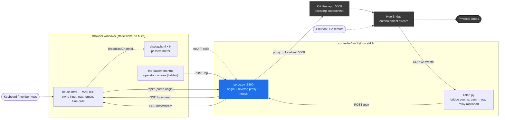
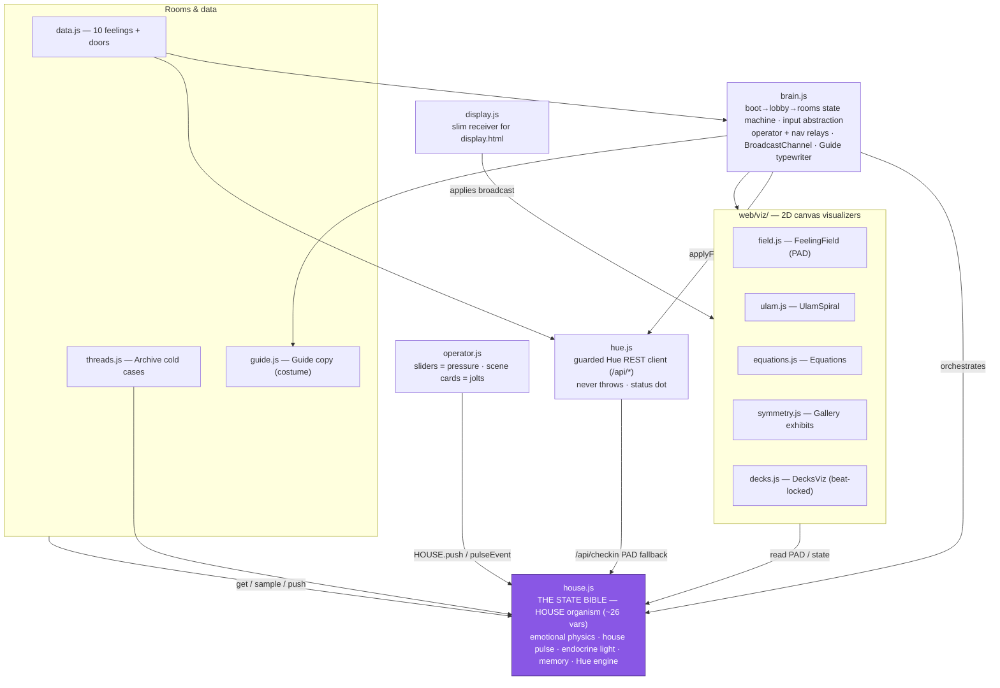
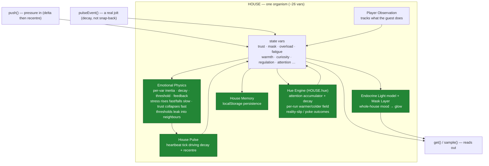
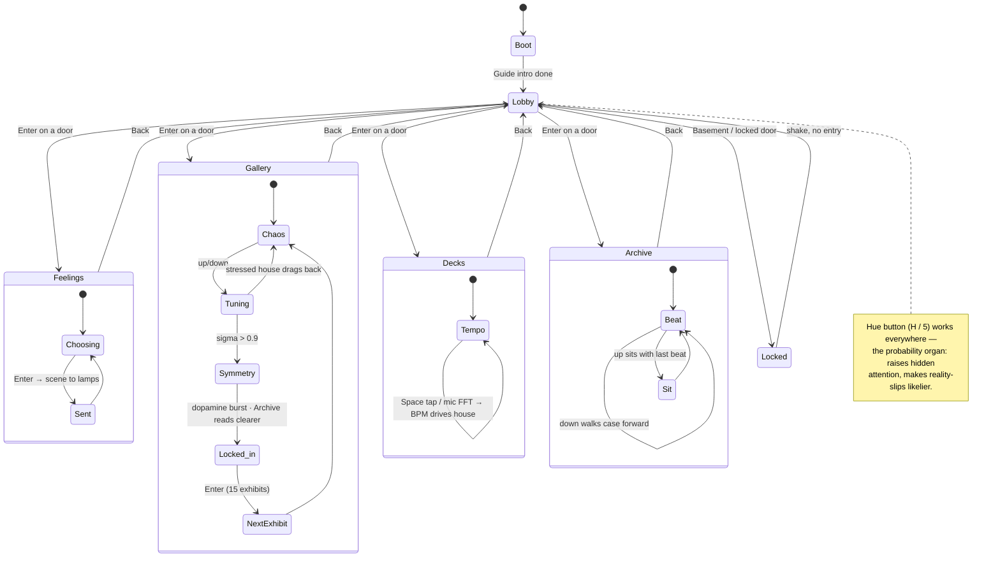

# DEEP HOUSE — Project Overview

> Auto-generated by the `project-overview` skill. **Edit graphs in `docs/graphs/src/*.mmd` only**, then rerun the skill's embed step — the fenced blocks below are regenerated between the `graph:*` markers and will overwrite hand-edits.

## Synopsis

**DEEP HOUSE** is an interactive light-and-detective art installation for BHL440. It runs as *one organism* — a house with a nervous system, not a set of rooms. Guests wander in for lights and music; underneath, every room reads from and writes to a single shared state (the "State Bible"), so calming one room quietly changes another. Feelings-first, carried by **light, math, and music**, never by prose about anyone. An authenticity firewall keeps the private corpus out of this repo entirely (it lives in a separate `Secrets/` project).

## Stack & Entry Points

| Layer | Tech | Notes |
|---|---|---|
| Experience | Static HTML/CSS/JS (`web/`) | No build step, no dependencies, plain 2D canvas |
| Controller | Python 3 stdlib (`controller/`) | No packages — `serve.py` (origin+proxy), `listen.py` (remote) |
| Light output | C# Hue app on `:5000` | Existing, untouched; reached only via `serve.py` proxy |

**Entry points**
- `python controller/serve.py` — the one process that must run. Serves `web/` on `:8800`, reverse-proxies `/api/*` → `localhost:5000`, relays `/op` and `/nav` over SSE. **Start it first** (after the C# app).
- `http://127.0.0.1:8800/house.html` — master window, owns keyboard/nav/tempo/Hue.
- `http://localhost:8800/display.html` — passive mirror for TV/projector.
- `http://localhost:8800/the-basement.html` — hidden operator console.
- `python controller/listen.py` — optional: wires the physical 4-button remote.

## System Topology

Runtime processes and the transports between them. `serve.py` is the keystone — it makes the browser same-origin with the Hue API (no CORS edit in the C# app) and makes BroadcastChannel multi-window sync legal.

<!-- graph:system-topology:begin -->

<!-- graph:system-topology:end -->

## Module Graph

The front-end collapses onto one god node: `house.js`, the State Bible. Every room reads (`get`/`sample`) and pushes to `HOUSE`; rooms invent no rules of their own.

<!-- graph:module-graph:begin -->

<!-- graph:module-graph:end -->

## HOUSE Internals

The engines inside `house.js` that make the state feel alive — physics, heartbeat, endocrine light, memory, and the Hue probability organ.

<!-- graph:state-internals:begin -->

<!-- graph:state-internals:end -->

## Key Flows

The guest's path: `boot → lobby → rooms`, one shared HOUSE underneath. The Hue button works in every room as the probability organ.

<!-- graph:runtime-flow:begin -->

<!-- graph:runtime-flow:end -->

## Architecture Notes

**Keystones**
- **Same-origin proxy** (`serve.py`) — the browser talks to the Hue API without touching the C# app, and BroadcastChannel multi-window sync becomes legal. Nothing works without it.
- **4-action input abstraction** (`up/down/select/back` + the universal `hue` press) — keyboard, number keys, and the physical remote collapse into one event stream, so wiring the remote later is additive, not a rewrite.
- **Single shared state** (`house.js`) — rooms are organs, not islands. All meaning flows through one organism with its own physics (inertia, decay, threshold leaks).

**Seams & decisions**
- Light *control* still runs through the C# app on `:5000`; a Python-native Hue client is a noted future option, not a plan. **Open decision (STATE.md):** spatial light immersion — drive per-lamp colour from JS by screen position, or fork/pimp the C# Hue program (which holds prior research). Not yet decided.
- Resilience is designed in: Hue app down → visuals keep running, red "lights offline" dot, every API call guarded with a 4s timeout and auto-heal. Mic denied → tap-tempo is first-class. Remote unwired → keyboard always works.

**The authenticity firewall (non-negotiable)**
No prose about a real person renders anywhere. On-screen text is limited to feeling-words, math, and the Guide (openly a costume). Private source material is not part of this public copy.

## Graph Index

| Diagram | Source | GitHub wrapper | Obsidian wrapper |
|---|---|---|---|
| System topology | `graphs/src/system-topology.mmd` | `graphs/github/system-topology.md` | `graphs/obsidian/system-topology.md` |
| Module graph | `graphs/src/module-graph.mmd` | `graphs/github/module-graph.md` | `graphs/obsidian/module-graph.md` |
| HOUSE internals | `graphs/src/state-internals.mmd` | `graphs/github/state-internals.md` | `graphs/obsidian/state-internals.md` |
| Key flows | `graphs/src/runtime-flow.mmd` | `graphs/github/runtime-flow.md` | `graphs/obsidian/runtime-flow.md` |

> Rendering to SVG/PNG is deferred (no mermaid CLI installed). See `graphs/render.md` for the one-line command when you want static images.
