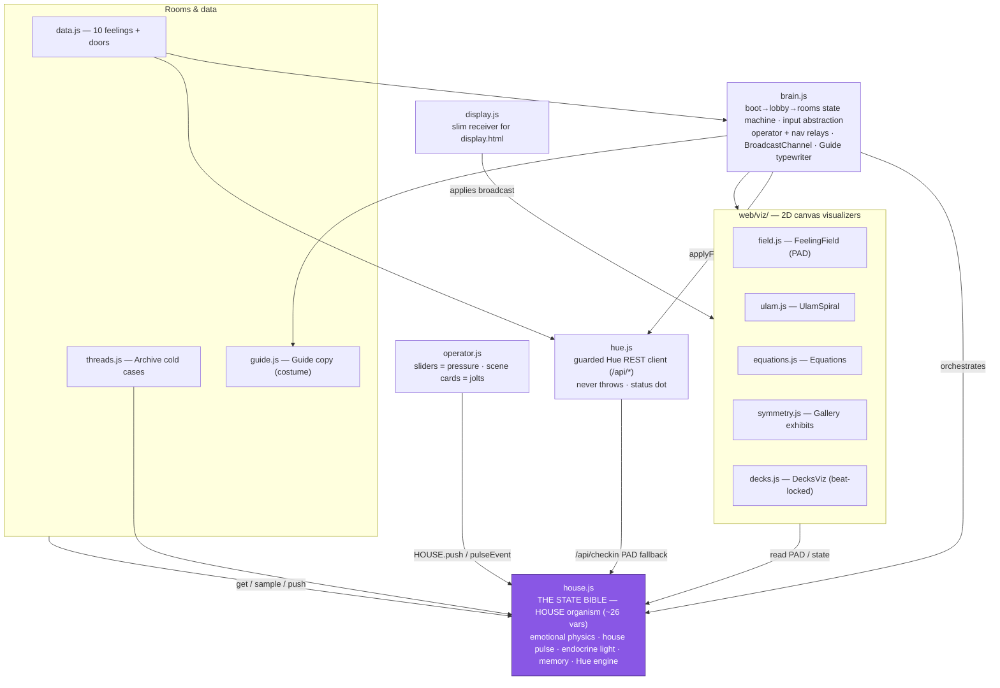

> [!abstract] Module Graph
> `house.js` is the god node / State Bible. Transclude with `![[module-graph]]`. Source: `graphs/src/module-graph.mmd`.

```mermaid
flowchart TD
    House["house.js<br/>THE STATE BIBLE — HOUSE organism (~26 vars)<br/>emotional physics · house pulse · endocrine light · memory · Hue engine"]

    Brain["brain.js<br/>boot→lobby→rooms state machine · input abstraction<br/>operator + nav relays · BroadcastChannel · Guide typewriter"]

    subgraph rooms["Rooms & data"]
        Data["data.js — 10 feelings + doors"]
        Guide["guide.js — Guide copy (costume)"]
        Threads["threads.js — Archive cold cases"]
    end

    subgraph viz["web/viz/ — 2D canvas visualizers"]
        Field["field.js — FeelingField (PAD)"]
        Ulam["ulam.js — UlamSpiral"]
        Equations["equations.js — Equations"]
        Symmetry["symmetry.js — Gallery exhibits"]
        Decks["decks.js — DecksViz (beat-locked)"]
    end

    Hue["hue.js<br/>guarded Hue REST client (/api/*)<br/>never throws · status dot"]
    Operator["operator.js<br/>sliders = pressure · scene cards = jolts"]
    Display["display.js<br/>slim receiver for display.html"]

    Brain -->|orchestrates| House
    Brain --> viz
    Brain --> Guide
    Brain -->|applyFeeling| Hue
    Data --> Brain
    Data --> Hue
    Threads --> House
    rooms -->|get / sample / push| House
    viz -->|read PAD / state| House
    Operator -->|HOUSE.push / pulseEvent| House
    Display -->|applies broadcast| viz
    Hue -->|"/api/checkin PAD fallback"| House

    classDef god fill:#8957e5,stroke:#3d1d7a,color:#fff
    class House god
```
