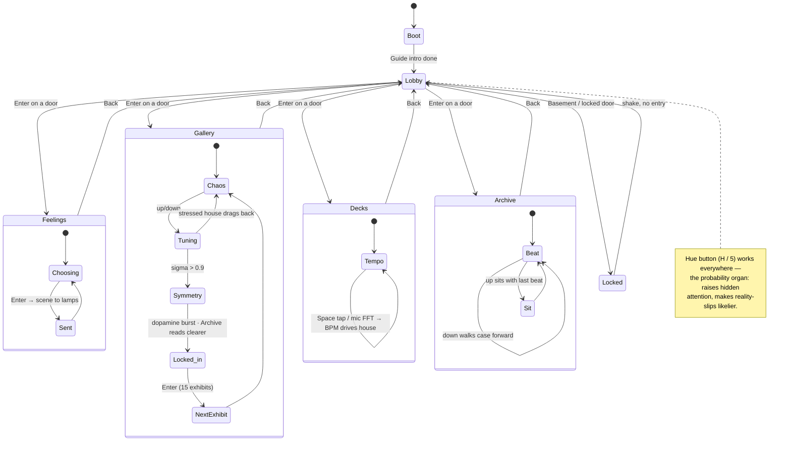

> [!abstract] Key Flows
> `boot → lobby → rooms`, one shared HOUSE underneath. Transclude with `![[runtime-flow]]`. Source: `graphs/src/runtime-flow.mmd`.

```mermaid
stateDiagram-v2
    [*] --> Boot
    Boot --> Lobby : Guide intro done

    Lobby --> Feelings : Enter on a door
    Lobby --> Gallery : Enter on a door
    Lobby --> Decks : Enter on a door
    Lobby --> Archive : Enter on a door
    Lobby --> Locked : Basement / locked door
    Locked --> Lobby : shake, no entry

    Feelings --> Lobby : Back
    Gallery --> Lobby : Back
    Decks --> Lobby : Back
    Archive --> Lobby : Back

    state Feelings {
        [*] --> Choosing
        Choosing --> Sent : Enter → scene to lamps
        Sent --> Choosing
    }
    state Gallery {
        [*] --> Chaos
        Chaos --> Tuning : up/down
        Tuning --> Symmetry : sigma > 0.9
        Symmetry --> Locked_in : dopamine burst · Archive reads clearer
        Locked_in --> NextExhibit : Enter (15 exhibits)
        NextExhibit --> Chaos
        Tuning --> Chaos : stressed house drags back
    }
    state Decks {
        [*] --> Tempo
        Tempo --> Tempo : Space tap / mic FFT → BPM drives house
    }
    state Archive {
        [*] --> Beat
        Beat --> Beat : down walks case forward
        Beat --> Sit : up sits with last beat
        Sit --> Beat
    }

    note right of Lobby
        Hue button (H / 5) works everywhere —
        the probability organ: raises hidden
        attention, makes reality-slips likelier.
    end note
```
