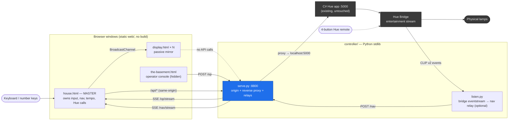

> [!abstract] System Topology
> Runtime processes + transports. Transclude with `![[system-topology]]`. Source: `graphs/src/system-topology.mmd`.

```mermaid
flowchart LR
    KB([Keyboard / number keys])
    Remote([4-button Hue remote])

    subgraph browser["Browser windows (static web/, no build)"]
        Master["house.html — MASTER<br/>owns input, nav, tempo, Hue calls"]
        Display["display.html × N<br/>passive mirror"]
        Operator["the-basement.html<br/>operator console (hidden)"]
    end

    subgraph py["controller/ — Python stdlib"]
        Serve["serve.py :8800<br/>origin + reverse proxy + relays"]
        Listen["listen.py<br/>bridge eventstream → nav relay (optional)"]
    end

    Csharp["C# Hue app :5000<br/>(existing, untouched)"]
    Bridge["Hue Bridge<br/>entertainment stream"]
    Lamps(["Physical lamps"])

    KB --> Master
    Remote -.-> Bridge
    Master -->|"BroadcastChannel"| Display
    Operator -->|"POST /op"| Serve
    Serve -->|"SSE /op/stream"| Master
    Listen -->|"POST /nav"| Serve
    Serve -->|"SSE /nav/stream"| Master
    Bridge -->|"CLIP v2 events"| Listen

    Master -->|"/api/* (same-origin)"| Serve
    Display -.->|"no API calls"| Serve
    Serve -->|"proxy → localhost:5000"| Csharp
    Csharp --> Bridge --> Lamps

    classDef origin fill:#1f6feb,stroke:#0b3a8a,color:#fff
    classDef ext fill:#3a3a3a,stroke:#111,color:#eee
    class Serve origin
    class Csharp,Bridge,Lamps ext
```
